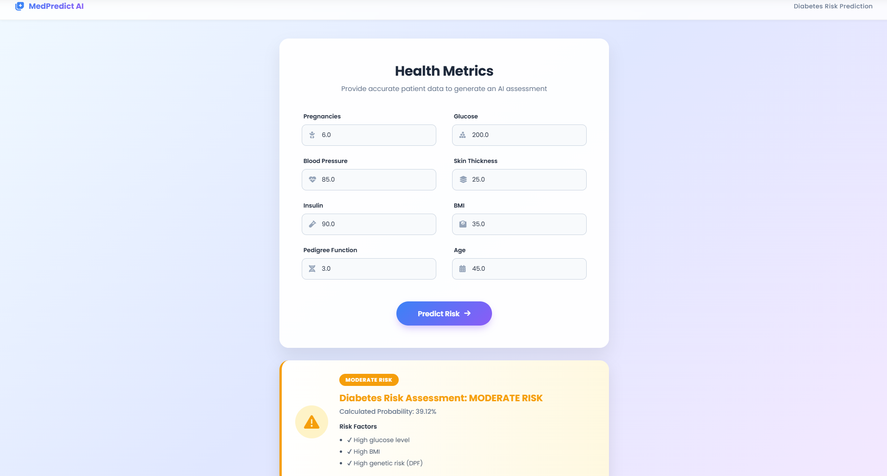

# 🩺 Diabetes Risk Prediction Web App

An AI-powered web application that predicts the risk of diabetes based on patient health metrics. Built using **Flask**, **Machine Learning**, and a modern **HTML/CSS UI**.

---

## 🚀 Features

* 🔍 Predict diabetes risk using trained ML model
* 📊 Displays probability score and risk level
* 🎨 Modern responsive UI with glassmorphism design
* ⚡ Fast predictions using pre-trained model
* 🧠 Intelligent risk classification:

  * 🟢 Low Risk
  * 🟡 Moderate Risk
  * 🔴 High Risk

---

## 🛠️ Tech Stack

* **Frontend:** HTML5, CSS3
* **Backend:** Python (Flask)
* **Machine Learning:** Scikit-learn
* **Model Storage:** Pickle (`model.pkl`)

---

## 📁 Project Structure

```
MEDICAL_AI/
│
├── static/
│   └── style.css          # UI styling
│
├── templates/
│   └── index.html         # Frontend (Jinja2 template)
│
├── app.py                 # Flask application
├── model.pkl              # Trained ML model
├── train_model.py         # Model training script (optional)
```

---

## ⚙️ Installation & Setup

### 1️⃣ Clone the repository

```bash
git clone https://github.com/your-username/diabetes-risk-prediction.git
cd diabetes-risk-prediction
```

### 2️⃣ Create virtual environment (optional but recommended)

```bash
python -m venv venv
venv\Scripts\activate   # Windows
```

### 3️⃣ Install dependencies

```bash
pip install flask numpy scikit-learn
```

### 4️⃣ Run the application

```bash
python app.py
```

### 5️⃣ Open in browser

```
http://127.0.0.1:5000/
```

---

## 📊 Input Parameters

The model uses the following medical attributes:

* Pregnancies
* Glucose Level
* Blood Pressure
* Skin Thickness
* Insulin
* BMI
* Diabetes Pedigree Function (DPF)
* Age

---

## 🧠 How It Works

1. User enters health metrics
2. Data is sent to Flask backend
3. ML model predicts probability
4. Risk level is classified:

   * **< 30% → Low Risk**
   * **30% – 60% → Moderate Risk**
   * **> 60% → High Risk**
5. Result is displayed with visual indicators

---

## ⚠️ Disclaimer

This project is for **educational and demonstration purposes only**.
It is **not a medical diagnosis tool**. Always consult a healthcare professional.

---

## 📌 Future Improvements

* 📈 Add graphical risk visualization (charts/gauge)
* 🔐 User authentication system
* ☁️ Deploy to cloud (Render / AWS / Heroku)
* 📱 Improve mobile UX
* 🗄️ Store prediction history

---
## 📸 Application Preview

<p align="center">
  
</p>
